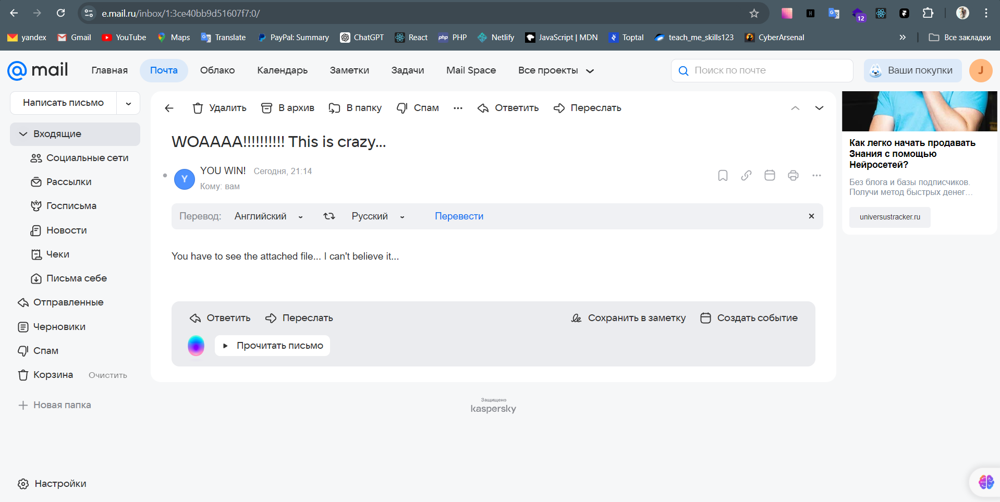

# Diplom Project
-------

- [Diplom Project](#diplom-project)
  * [Расследование инцидентов](#---)
  * [Скрипт на Python, который в информативном виде запускает скрипт с установкой](#---)
  * [Автоматизация процеса проверки url через virustotal (JavaScript)](#---)
  * [Уязвимость CVE-2021-41773 на web сервере](#---)
  * [Отправить фишинговое письмо](#---)
  * [Установка SIEM системы](#---)


## Расследование инцидентов 

1. Использование логов Firewall для обнаружения угроз.
- Мониторинг подозрительных IP: Проверка на повторные соединения с необычных или черных IP.
- Обнаружение сканирования портов: Анализ частых подключений к разным портам за короткий промежуток времени.
- Необычные трафиковые паттерны: Поиск аномальных пиков трафика или подключений к нестандартным портам.
- Анализ заблокированных запросов: Фокус на отказанных соединениях для выявления попыток вторжений.
- Геолокация: Отслеживание трафика из высокорисковых стран или регионов.

2. Как расследовать инцидент SQL-инъекции (IDS-алерт)
- Проверка оповещения: Анализ логов IDS на наличие индикаторов SQL-инъекций (например, ' OR 1=1 --).
- Анализ HTTP-запросов: Проверка запросов на сервере веб-приложения на наличие вредоносных данных.
- Проверка логов базы данных: Поиск неожиданных или несанкционированных запросов к базе данных.
- Проверка WAF: Анализ действий WAF (защита веб-приложений) для блокировки/разрешения запроса.
- Идентификация атакующего: Трассировка IP-адреса источника атаки.
- Ответные меры:
  -  Временная блокировка атакующего IP.
  - Патчинг уязвимого веб-приложения.
  - Внедрение валидации входных данных для предотвращения повторных атак.

3. Обнаружение использования инструментов для дампа паролей и украденных учетных данных
- Обнаружение инструментов для дампа паролей:
  - Доступ к LSASS: Мониторинг процессов, пытающихся получить доступ к LSASS (например, Mimikatz).
  - Необычные процессы и команды: Обнаружение выполнения команд для извлечения паролей, таких как procdump, lsass.exe.
  - Сканирование реестра Windows: Выявление попыток чтения реестра для получения хешей паролей.
  - Сетевые запросы: Мониторинг сетевой активности для вывода данных с системы.
- Обнаружение дальнейшего незаконного использования украденных учетных данных:
  - Аномальная активность пользователей: Проверка входов с необычных IP-адресов, или в нетипичное время.
  - Многоразовое использование паролей: Мониторинг попыток использования одних и тех же учетных данных на нескольких сервисах.
  - Анализ логинов и сетевого трафика: Проверка сессий и сетевых запросов на наличие аномальных паттернов.

4. Сценарии обнаружения угроз в компании с офисами в Москве и Перми (VPN, FW, ACS)
- Необычные подключения по VPN: Проверка на подключения из стран или IP-диапазонов, не характерных для сотрудников.
- Необычные запросы в VPN-логах: Анализ на необычные сессии или частые попытки подключения с неправильными учетными данными.
- Доступ в физическую систему контроля: Анализ входов и выходов сотрудников из офисов, особенно в нерабочее время или с других устройств.
- Необычные запросы в FW: Проверка на попытки проникновения через открытые порты и IP, не принадлежащие корпоративной сети.

5. Корреляционные правила для анализа логов антивируса
- Обнаружение новых угроз и аномальной активности: Корреляция событий с обнаружением известных угроз (например, трояны, шпионские программы).
- Множественные предупреждения на одном устройстве: Алгоритм, который отслеживает несколько предупреждений по одному устройству за короткий период времени.
- Запуск неизвестных приложений: Обнаружение неавторизованных или подозрительных приложений, которые запускаются в системе.
- Обнаружение вторичных атак (к примеру, ретрансляция или брутфорс): Корреляция попыток вторичных атак, таких как брутфорс атак на приложения или службы.

7. Этот лог — это сетевой журнал (пакеты), скорее всего, с DNS-сервера или устройства, связанного с ним. Лог содержит записи о запросах, сделанных через UDP для разрешения PTR записей (обратный DNS-запрос).

> Информация о логах:

- Дата и время: Все запросы происходят 20 июня 2019 года в 09:26:24.
- IP-адрес источника: Все запросы исходят от IP-адреса 10.10.160.208.
- Тип пакета: Запросы отправлены через UDP, что характерно для DNS-запросов.
- Запросы PTR: Каждая строка представляет собой PTR-запрос для разрешения доменов, и ответ на них — NXDOMAIN, что означает, что домен не существует.
- Доменные имена: В запросах используется структура доменных имен, например:
```mggw-at-f3f0c6e992b7562598d9865b6fe8b3a6.com```

> Возможные выводы:

1. DNS-запросы исходят от устройства с IP 10.10.160.208, пытающегося разрешить обратные DNS-записи (PTR-запросы).
2. Ответы на запросы показывают, что домены не существуют (NXDOMAIN), что может указывать на попытки разрешить случайные или несуществующие домены.
3. Частые запросы с похожими доменами могут свидетельствовать о возможном сканировании или попытке обнаружить скрытые сервисы в сети.

> Что можно предпринять:

- Проверить, что инициирует эти запросы — возможно, это какой-то скрипт или вредоносное ПО.
- Если запросы идут с конкретного устройства (например, сервера), стоит проверить его на наличие компрометации.
- Проанализировать, не используется ли это как часть более крупной атаки (например, разведка или попытки скрытного общения через домены).

-------

## Скрипт на Python, который в информативном виде запускает скрипт с установкой

```Python
import os
import subprocess
import platform

def run_command(command, description):
    """
    Выполняет команду в терминале и выводит описание процесса.
    """
    print(f"[INFO] {description}...")
    try:
        subprocess.run(command, shell=True, check=True)
        print(f"[SUCCESS] {description} завершено.\n")
    except subprocess.CalledProcessError as e:
        print(f"[ERROR] {description} завершено с ошибкой: {e}\n")
        exit(1)


def install_avml():
    """
    Устанавливает AVML для создания дампа памяти.
    """
    avml_url = "https://github.com/microsoft/avml/releases/latest/download/avml"
    avml_path = "/usr/local/bin/avml"
    
    try:
        # Пробуем установить в стандартную директорию
        run_command(f"curl -L {avml_url} -o {avml_path} && chmod +x {avml_path}",
                    "Установка AVML в /usr/local/bin")
    except SystemExit:
        # Если ошибка, пробуем установить в домашнюю директорию
        print("[INFO] Не удалось установить AVML в /usr/local/bin. Пробуем установить в домашнюю директорию.")
        avml_path = os.path.expanduser("~/avml")
        run_command(f"curl -L {avml_url} -o {avml_path} && chmod +x {avml_path}",
                    "Установка AVML в домашнюю директорию")
        print(f"[INFO] AVML установлен в {avml_path}. Добавьте эту директорию в PATH.")


def install_volatility():
    """
    Устанавливает Volatility Framework.
    """
    run_command("pip install volatility3", "Установка Volatility Framework")


def install_dwarf2json():
    """
    Устанавливает Dwarf2json.
    """
    dwarf2json_dir = "dwarf2json"
    dwarf2json_repo = "https://github.com/volatilityfoundation/dwarf2json.git"

    if os.path.exists(dwarf2json_dir):
        print("[INFO] Директория 'dwarf2json' уже существует. Попробуем обновить репозиторий.")
        run_command(f"cd {dwarf2json_dir} && git pull && go build",
                    "Обновление и сборка Dwarf2json")
    else:
        run_command(f"git clone {dwarf2json_repo} && cd {dwarf2json_dir} && go build",
                    "Установка Dwarf2json")


def create_symbol_table(kernel_path):
    """
    Создает symbol table для кастомного ядра Linux.
    """
    dwarf2json_path = "./dwarf2json/dwarf2json"
    symbol_table_output = "./kernel-symbol-table.json"
    run_command(f"{dwarf2json_path} linux --elf {kernel_path} > {symbol_table_output}",
                "Создание Symbol Table")


if __name__ == "__main__":
    if platform.system() != "Linux":
        print("[ERROR] Этот скрипт поддерживается только на Linux.")
        exit(1)

    print("[INFO] Начало процесса установки и настройки...\n")
    install_avml()
    install_volatility()
    install_dwarf2json()

    print("[SUCCESS] Все этапы завершены успешно.")

```

> Запуск:

```sh
python3 script.py
```

--------

## Автоматизация процеса проверки url через virustotal (JavaScript)

> Необходимо зарегистрироваться на https://www.virustotal.com и получить приватный API KEY

> Необходимо установить Node.js 

```sh
node --version
```

Зависимости:

```sh
npm install axios
```

```JavaScript
const axios = require('axios');
const readline = require('readline');

// API-ключ VirusTotal
const API_KEY = "virus_total_key";

// Интерфейс для чтения аргументов из консоли
const rl = readline.createInterface({
  input: process.stdin,
  output: process.stdout,
});

if (process.argv.length < 3) {
  console.error("Использование: node script.js <URL>");
  process.exit(1);
}

const urlToCheck = process.argv[2];

// Функция отправки URL на проверку
const sendUrlForScan = async (url) => {
  try {
    const response = await axios.post('https://www.virustotal.com/vtapi/v2/url/scan', null, {
      params: {
        apikey: API_KEY,
        url: url,
      },
    });

    if (response.data && response.data.scan_id) {
      return response.data.scan_id;
    } else {
      throw new Error("Не удалось отправить URL на проверку.");
    }
  } catch (error) {
    throw new Error(`Ошибка: ${error.message}`);
  }
};

// Функция получения результата анализа
const getScanResult = async (scanId) => {
  try {
    const response = await axios.get('https://www.virustotal.com/vtapi/v2/url/report', {
      params: {
        apikey: API_KEY,
        resource: scanId,
      },
    });

    if (response.data && response.data.positives != null) {
      return {
        positives: response.data.positives,
        total: response.data.total,
        permalink: response.data.permalink,
      };
    } else {
      throw new Error("Не удалось получить результаты анализа.");
    }
  } catch (error) {
    throw new Error(`Ошибка: ${error.message}`);
  }
};

// Проверка
(async () => {
  try {
    console.log("Отправка URL на проверку...");
    const scanId = await sendUrlForScan(urlToCheck);
    console.log(`URL отправлен на проверку. Scan ID: ${scanId}`);
    console.log("Ожидание ...");

    await new Promise((resolve) => setTimeout(resolve, 10000));

    console.log("Получение результатов анализа...");
    const result = await getScanResult(scanId);

    console.log("Результаты анализа:");
    console.log(`Результат выполнения: ${result.positives} из ${result.total}`);
    console.log(`Подробнее: ${result.permalink}`);
  } catch (error) {
    console.error(error.message);
  } finally {
    rl.close();
  }
})();

```

Запуск программы:

```sh
node script.js <URL>
```


-------

## Уязвимость CVE-2021-41773 на web сервере

###### Описание уязвимости
* CVE-2021-41773 — это уязвимость в Apache HTTP Server версии 2.4.49, которая позволяет злоумышленникам выполнять Directory Traversal и читать файлы за пределами веб-каталога. В случае, если конфигурация позволяет запись в каталоге, злоумышленник может загрузить вредоносные файлы, что ведет к выполнению произвольного кода.

###### Цель
* Обеспечить устранение уязвимости CVE-2021-41773 на затронутом сервере и предотвратить её эксплуатацию.

1. Подтверждение версии Apache

```sh
apache2 -v
```
Если версия 2.4.50 и ниже, сервер уязвим.

2. Обновление Apache HTTP Server

```sh
sudo apt update
sudo apt install --only-upgrade apache2
```

Перезапуск Apache после обновления
```sh
sudo systemctl restart apache2
```

3. Проверка устранения уязвимости
```sh
curl --path-as-is http://<IP-server>/%2e%2e/%2e%2e/etc/passwd
```

4. Рекомендации по усилению безопасности
 
> Ограничение доступа к важным файлам и директориям:

- В файле конфигурации Apache (/etc/apache2/apache2.conf) добавить или изменить настройки:
```xml
<Directory />
    AllowOverride None
    Require all denied
</Directory>
```

> Отключение ненужных модулей:

- Проверка загруженных модулей и отключение ненужных:
```sh
apache2ctl -M
```
- Модуль ``` mod_autoindex ``` должен быть отключён, если он не используется.

> Включение Web Application Firewall (WAF):

- Установка и настройка модуля ModSecurity
```sh
sudo apt install libapache2-mod-security2
sudo systemctl restart apache2
```

> Мониторинг логов:
```sh
tail -f /var/log/apache2/access.log
tail -f /var/log/apache2/error.log
```

Уязвимость CVE-2021-41773 была успешно устранена путём обновления Apache HTTP Server до последней версии.


--------

## Отправить фишинговое письмо

> Установка SEToolkit:

```sh
git clone https://github.com/trustedsec/social-engineer-toolkit/ setoolkit/
cd setoolkit
pip3 install -r requirements.txt
python3 setup.py install
```

> Зависимости Python

```sh
sudo apt-get install python3
sudo apt-get install python3-pip
pip3 install --upgrade setuptools
```

```sh
pip3 install -r requirements.txt --upgrade
```

> Проверка прав доступа:

```sh
sudo python3 setoolkit
```




-------

## Установка SIEM системы

1. Установка Wazuh
   - Загрузить OVA-файл Wazuh с официального сайта.
   - Импортировать файл OVA в виртуальную машину (например, VirtualBox или VMware).
   - Запустить виртуальную машину и выполнить первоначальную настройку (сетевые параметры, учетные данные).
>
2. Настройка логирования Windows
- Установка Wazuh Agent на Windows:
  - Загрузка агента с официального сайта Wazuh.
  - Установка агента, указав IP-адрес Wazuh Manager.
- Настройка агента:
  - Необходимо отредактировать файл конфигурации агента ```(ossec.conf)```:
    ```xml
    <server>
      <address>IP_Wazuh_Manager</address>
      <port>1514</port>
    </server>
    ```
  - Необходимо перезапустить агент.
- Включить логирование Windows:
  - Настройка сбора событий, таких как Security, Application, и System, в ```ossec.conf```.
- Проверка соединения:
  - Нужно убедиться, что агент отображается в Wazuh Dashboard.
>
3. Настройка логирования Linux (syslog/auditd)
- Установка Wazuh Agent на Linux:
  > Добавить репозиторий Wazuh:
  ```sh
  curl -s https://packages.wazuh.com/key | sudo apt-key add -
  echo "deb https://packages.wazuh.com/4.x/apt/ stable main" | sudo tee /etc/apt/sources.list.d/wazuh.list
  ```
  > Установить агент:
  ```sh
  sudo apt update
  sudo apt install wazuh-agent
  ```
- Настроить агент:
  > Изменить файл /var/ossec/etc/ossec.conf
  ```xml
  <server>
    <address>IP_Wazuh_Manager</address>
    <port>1514</port>
  </server>
  ```
- Включить сбор syslog:
  > Добавить следующий раздел в ossec.conf:
  ```xml
  <localfile>
    <log_format>syslog</log_format>
    <location>/var/log/syslog</location>
  </localfile>
  ```
- Включить Auditd:
  > Установить auditd и его плагины:
  ```sh
  sudo apt install auditd audispd-plugins
  ```
  > Настроить отправку данных в Wazuh:
  ###### В файле /etc/audisp/plugins.d/syslog.conf установите:
  
  ```plaintext
  active = yes
  direction = out
  path = builtin_syslog
  type = builtin
  args = LOG_INFO
  format = string
  ```
- Перезапустить службы:
  > Для агента Wazuh:
  ```sh
  sudo systemctl restart wazuh-agent
  ```
  > Для Auditd:
  ```sh
  sudo systemctl restart auditd
  ```


